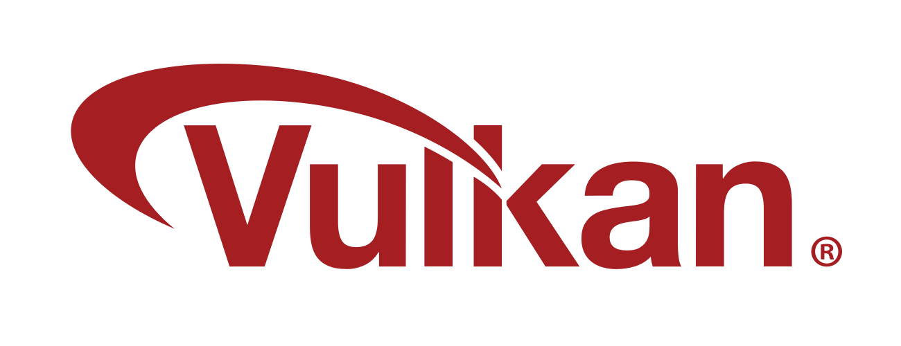

### Hi there 👋

<!--
**ArturMarschenkulov/ArturMarschenkulov** is a ✨ _special_ ✨ repository because its `README.md` (this file) appears on your GitHub profile.

Here are some ideas to get you started:

- 🔭 I’m currently working on ...
- 🌱 I’m currently learning ...
- 👯 I’m looking to collaborate on ...
- 🤔 I’m looking for help with ...
- 💬 Ask me about ...
- 📫 How to reach me: ...
- 😄 Pronouns: ...
- ⚡ Fun fact: ...
-->

<h2 align="center">Artur Marschenkulov</h2>

  I'm <b>Artur Marschenkulov</b>, live in <b>Hamburg, Germany</b> and a Student in the <b>Hamburg University of Technology (TUHH)</b> right now.

Among my interests are:
- My interests are **Graphics Programming**. [JadeFrame](https://github.com/ArturMarschenkulov/JadeFrame) is a personal project written in **C++**, where I implement a graphics framework/engine from scratch for education purposes (no GLFW, SDL etc). One of the main goals is to abstract over various Graphics APIs, such as **OpenGL**, **Vulkan**, **D3D11**, **D3D12** and **software rendering** (only **OpenGL** and **Vulkan** right now).

- **Low-level programming** close to the silicon/metal, be it CPU and GPU.
  
- Learning about **programming languages concepts** and creating **programming languages**. [Ice](https://github.com/ArturMarschenkulov/ice-lang-rust) is a programming language written in **Rust**. The goal is to create a strong statically typed language.

- **Circassian** language. I'm pationate about helping to make the language easier to learn for everybody. [Circassian](https://github.com/ArturMarschenkulov/circassian) is a repo about gathering general information. There I'm also writing a Circassian verb conjugator in **Rust**, for a language with a very complex verbal morphology. I'm  a hobby linguist.

I'm a programming language connoisseur, and I'm always interested in learning about new languages. I have dabbled in languages like Python, Haskell, Julia, C#, Java, Swift, Ocaml, etc. with descending order of exposure.

<h2 align="center">Technologies</b>

<h2 align="center">Languages</b>

<h3 align="center">Technologies</b>

  

<h2 align="center">Achievements</h2>

  

<!-- <h2 align="center">Profile Statistics</b>

   
    
  

 -->

